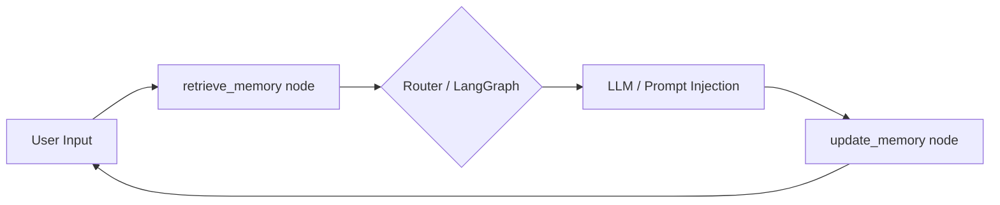

# Multi-Memory Agent with LangGraph (Lab #17)

## Overview
This project implements a Multi-Memory Agent based on the LangGraph framework. It features 4 types of memories (Short-term, Long-term Profile, Episodic, and Semantic) with a unified Memory Extraction Layer and strict token budgeting for prompt injection.

## Architecture



## Memory Systems
- **Profile (KV):** Explicit facts ("Tôi là", "Tôi thích"). Overwrites old facts to resolve conflicts.
- **Short-term:** Conversation buffer (last 5 messages).
- **Episodic:** Event logs. Tracks conflict resolutions (e.g., "User updated name from X to Y").
- **Semantic:** Vector store fallback (keyword-based document retrieval).

## ⚠️ Reflections on Privacy & Limitations

### 1. Most Dangerous Memory Types
**Semantic + Profile memory** are the most sensitive. 
If the system retrieves the wrong profile fact or semantic document for a user, it can lead to **Hallucination Amplification**. For instance, injecting another user's medical condition into the prompt could cause the LLM to give dangerous advice. 

### 2. Failure Cases
- **Retrieval Error:** If the vector database returns an irrelevant chunk, the LLM treats it as "ground truth" and hallucinates confidently.
- **Extraction Error:** If the rule-based extractor misinterprets "Tôi không thích X" as "Tôi thích X", the profile becomes permanently poisoned.

### 3. Scaling Issues (Limitations)
- **Vector DB Latency:** As the semantic memory grows, retrieval latency increases, making real-time chat sluggish.
- **Memory Noise:** Over time, episodic memory becomes cluttered with minor events, making it harder to find critical context.
- **Token Budget Constraints:** With very long profiles, the context window fills up, leaving no room for recent conversation history.

### 4. TTL, Deletion, and Consent
- PII (Personal Identifiable Information) must have a TTL (Time-To-Live).
- There must be an explicit API route to completely wipe a user's data across all 4 backends (`hard delete`).
- User consent should explicitly cover semantic ingestion (i.e., "Can we use your chat history to improve future answers?").

## Running the Project
```bash
# Setup
# Note: no external dependencies required for the skeleton implementation!

# Run main agent
python src/main.py

# Run benchmark scenarios
python tests/test_scenarios.py
```
